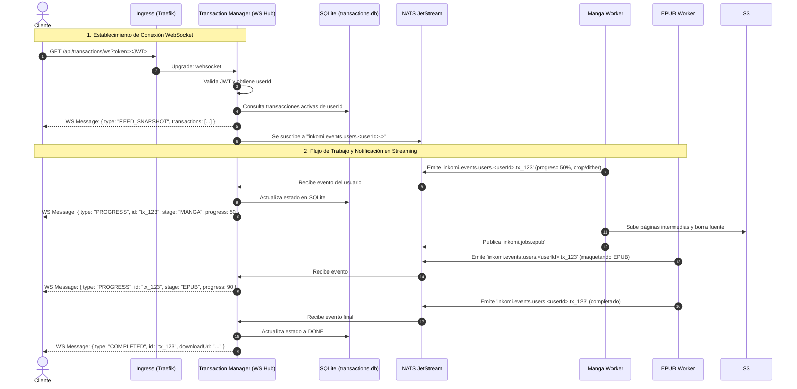

# Plan de Arquitectura Final: Migración a Microservicios (k3s + NATS)

## Resumen Ejecutivo y Decisiones Clave

1. **Orquestación**: Despliegue sobre **k3s**.
2. **Backbone de Mensajería y Eventos**: **NATS JetStream** para colas de trabajo y eventos jerárquicos (`inkomi.>`).
3. **Almacenamiento de Archivos (Cloud Storage)**: **Object Storage (S3 / MinIO)** con **Presigned URLs**. Los clientes suben archivos pesados directamente sin pasar por el backend.
4. **Base de Datos Desacoplada (SQLite dedicada por servicio)**:
   - **Transaction Manager**: Gestiona su propia **SQLite (`transactions.db`)** montada sobre un volumen PVC local de k3s en modo WAL. Incluye un cron interno de purga para transacciones viejas o terminadas.
   - **Auth & User Service**: Gestiona su propia **SQLite (`users.db`)** para usuarios y credenciales.
5. **Feed en Tiempo Real (WebSockets)**:
   - Los clientes abren una conexión **WebSocket (`/api/transactions/ws`)** con el **Transaction Manager**.
   - Al conectar, reciben un snapshot inicial de sus transacciones activas.
   - El Transaction Manager se suscribe al canal de NATS del usuario (`inkomi.events.users.<userId>.>`) y retransmite deltas de progreso (porcentaje, etapa, estado) por el WebSocket al feed del cliente en tiempo real.
6. **Workers Stateless**:
   - **Manga Worker**: Escala horizontalmente. Consume de NATS, descarga de S3, procesa imágenes con `imagev2`/`bimg` aplicando la configuración gráfica completa (`MangaSettings`) y borra el archivo fuente.
   - **EPUB Worker**: Ensambla el libro con la orientación de lectura (`leftToRight`) y conversión a Kepub.
7. **Global Event Listener / Auditor**: Escucha todos los eventos del clúster con `inkomi.>` para logs de auditoría y notificaciones Push (Firebase).

---

## Diagrama General de Arquitectura en k3s

```mermaid
flowchart TD
    Client["App Cliente (Web / Móvil)"]
    Ingress["Ingress Controller / API Gateway (Traefik)"]

    Client -->|HTTPS REST| Ingress
    Client <-->|"WSS (WebSocket Feed)"| Ingress

    subgraph k3s Cluster
        Ingress -->|/api/auth/*| AuthSvc["Auth & User Service"]
        Ingress <-->|/api/transactions/* (REST & WS)| TxManager["Transaction Manager (Hub WS)"]
        Ingress -->|/api/books/*| LibSvc["Library Service (Libgen)"]

        AuthSvc --- AuthDB[("SQLite: users.db (PVC)")]
        TxManager --- TxDB[("SQLite: transactions.db (PVC)")]

        TxManager -- "Publica Jobs y Eventos" --> NATS{{"NATS JetStream"}}
        NATS -- "Eventos por Usuario: inkomi.events.users.<userId>.>" --> TxManager

        NATS -- "Sub: inkomi.jobs.manga" --> MangaW["Manga Workers (xN Pods)"]
        NATS -- "Sub: inkomi.jobs.epub" --> EpubW["EPUB Workers (xN Pods)"]
        NATS -- "Sub: inkomi.>" --> EventListener["Global Event Listener & Push Service"]
    end

    Client -->|PUT Directo con Presigned URL| Storage[("Object Storage (MinIO / S3)")]
    MangaW <-->|Descarga Raw / Sube Procesado| Storage
    EpubW <-->|Descarga Procesado / Sube Final| Storage
    LibSvc -->|Sube Descargas MD5| Storage
    EventListener -->|Envía Push| Firebase["Firebase / Dropbox"]
```

---

## Flujo en Tiempo Real: WebSocket Feed del Cliente



---

## Desglose Detallado de Microservicios

### 1. Ingress & API Gateway (Traefik en k3s)

- **Responsabilidad**:
  - Terminación TLS y CORS.
  - Enrutamiento de peticiones HTTP habituales.
  - Soporte nativo para **WebSocket Upgrades** con timeouts de keep-alive adecuados (`proxy_read_timeout 3600s`).

---

### 2. Transaction Manager (Con WebSocket Hub)

- **Responsabilidad**:
  - **Endpoint WebSocket (`/api/transactions/ws`)**:
    - Autentica el cliente mediante el token JWT en la query string (`?token=...`) o en el handshake de WebSocket.
    - Mantiene en memoria un **Connection Hub** asociando cada conexión activa con su `userId`.
    - Al abrirse la conexión, envía un `FEED_SNAPSHOT` con el listado de transacciones activas desde `transactions.db`.
    - Mantiene una suscripción en NATS al canal `inkomi.events.users.<userId>.>`. Al recibir cualquier progreso o cambio de estado, lo propaga de inmediato al WebSocket del cliente.
  - **Endpoints REST**:
    - `POST /transactions/start`: Crea la transacción ligada al `userId` y genera la Presigned URL para S3.
    - `POST /transactions/{id}/ready`: Valida la existencia del archivo en S3 y encola el trabajo en NATS.
    - `GET /transactions/{id}/download`: Genera Presigned URL de descarga del libro terminado.
  - **Auto-Limpieza (Housekeeping Cron)**: Tarea periódica que purga registros en estado `DONE` o `ERROR` de más de 24 horas de antigüedad.
- **Persistencia**:
  - **SQLite (`transactions.db`)** sobre volumen PVC en modo WAL.

```sql
-- transactions.db
CREATE TABLE transactions (
    id TEXT PRIMARY KEY,
    user_id TEXT NOT NULL,
    status TEXT NOT NULL, -- WAITING_UPLOAD, QUEUED, PROCESSING_MANGA, PROCESSING_EPUB, DONE, ERROR
    progress INT DEFAULT 0, -- 0 a 100
    source_key TEXT,
    result_key TEXT,
    config_json TEXT NOT NULL,
    error_message TEXT,
    created_at DATETIME DEFAULT CURRENT_TIMESTAMP,
    updated_at DATETIME DEFAULT CURRENT_TIMESTAMP
);

CREATE INDEX idx_transactions_user ON transactions(user_id);
CREATE INDEX idx_transactions_status_updated ON transactions(status, updated_at);
```

#### Implementación del Hub WebSocket en Go:

```go
type WSHub struct {
    clients   map[string][]*websocket.Conn // map[userId][]Conexiones
    mu        sync.RWMutex
    natsConn  *nats.Conn
    db        *sql.DB
}

func (h *WSHub) HandleWS(w http.ResponseWriter, r *http.Request) {
    userID := authenticateJWT(r)
    conn, _ := upgrader.Upgrade(w, r, nil)
    h.registerClient(userID, conn)

    // 1. Envía snapshot inicial
    activeTxs := h.getActiveTransactions(userID)
    conn.WriteJSON(FeedMessage{Type: "FEED_SNAPSHOT", Data: activeTxs})

    // 2. Lee pings/pongs para mantener viva la conexión
    go h.readPump(userID, conn)
}

// Escucha en NATS para retransmitir a los WebSockets de ese usuario
func (h *WSHub) StartNATSListener() {
    h.natsConn.Subscribe("inkomi.events.users.*.>", func(msg *nats.Msg) {
        // Sujeto: inkomi.events.users.<userId>.<txId>
        parts := strings.Split(msg.Subject, ".")
        userID := parts[3]

        h.mu.RLock()
        connections := h.clients[userID]
        for _, conn := range connections {
            conn.WriteMessage(websocket.TextMessage, msg.Data)
        }
        h.mu.RUnlock()
    })
}
```

---

### 3. Auth & User Service

- **Responsabilidad**:
  - Registro y Login de usuarios (hashing Argon2id / Bcrypt).
  - Emisión de JWTs y Refresh Tokens.
- **Persistencia**:
  - **SQLite (`users.db`)** en un PVC dedicado en k3s.

---

### 4. Manga Worker (Procesado Gráfico)

- **Tecnología**: Go + `libvips` (`bimg`) / `imagev2`.
- **Responsabilidad**:
  - Consume trabajos de la cola `inkomi.jobs.manga`.
  - Emite eventos periódicos a `inkomi.events.users.<userId>.<txId>` conforme avanza procesando lotes de páginas (actualizando el porcentaje de progreso).
  - Aplica recorte, niveles, dithering y máscara de enfoque según `Config.Manga`.
  - Borra el archivo fuente de S3 y encola el trabajo a `inkomi.jobs.epub`.

---

### 5. EPUB Worker (Maquetado)

- **Tecnología**: Go + `kepubify`.
- **Responsabilidad**:
  - Consume de `inkomi.jobs.epub`.
  - Emite eventos de progreso en NATS al generar el EPUB y al convertir a Kepub.
  - Sube el resultado final al bucket S3 y emite el evento final de completado.

---

### 6. Library Service (Libgen)

- **Responsabilidad**:
  - Scraping y monitoreo de espejos Libgen.
  - Búsqueda y descarga de libros a S3 con URLs prefirmadas.

---

### 7. Global Event Listener & Notification Service

- **Responsabilidad**:
  - Suscripción global a `inkomi.>`.
  - Auditoría centralizada de eventos.
  - Notificaciones Push móviles vía Firebase cuando la app no está abierta con el WebSocket activo.
